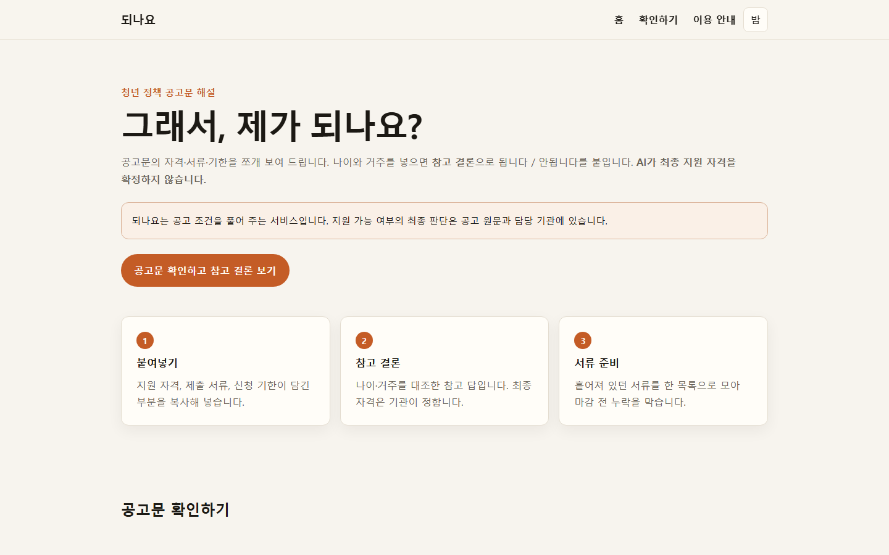
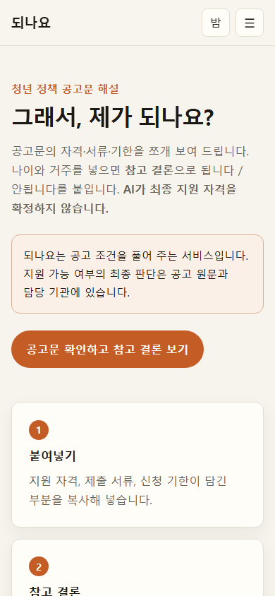
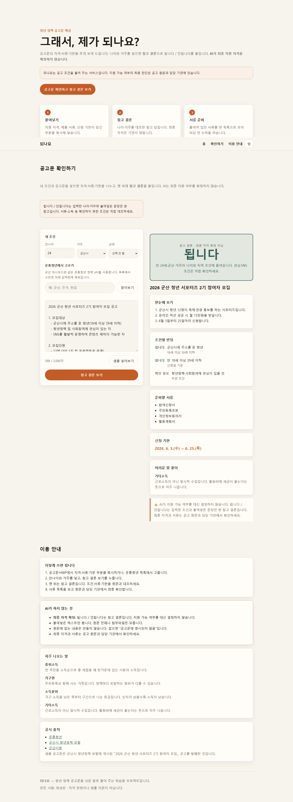
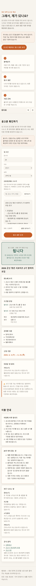
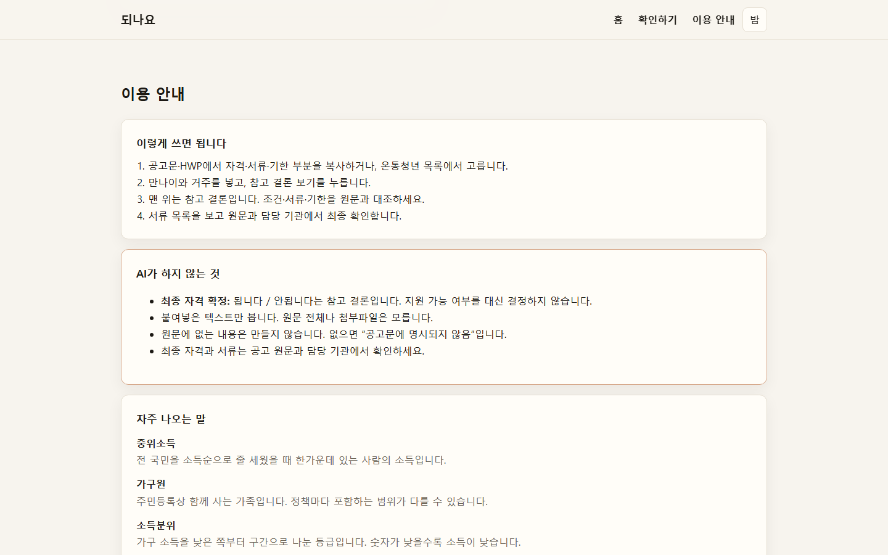

# 되나요 (Doenayo)

> 청소년부터 노년까지, **여덟 번만 답하면** 받을 수 있어 보이는 정책이 나옵니다

🔗 **배포 URL:** https://codyssey-6-pro-ject.vercel.app/  
🔗 **시작하기:** https://codyssey-6-pro-ject.vercel.app/  
🔗 **GitHub:** https://github.com/seongbin45/CODYSSEY_6_ProJect

**최종 지원 자격을 확정하지 않습니다.**  
됩니다 / 확인 필요는 고른 답과 정책 요약만 본 **참고 결론**입니다. 최종은 공고 원문과 담당 기관에서 확인하세요.

### 화면

| 데스크톱 | 모바일 |
|---|---|
|  |  |
|  |  |

이용 안내(한계 고지): 

---

## 1. 서비스 소개

### 왜 만들었나

정책은 청년만의 것이 아닙니다. 그런데 포털마다 대상이 갈라져 있고, 공고문은 한 화면에서 답하기 어렵습니다.

- 청소년·청년·중장년·노년, 임신·육아, 장애인, 소상공인, 전 국민 공통 정책을 한곳에서 묻고 싶었습니다
- 한 화면에 나이·거주·소득을 한꺼번에 넣으면 부담이 큽니다. 토스처럼 **한 질문만** 묻고 다음으로 갑니다
- 결과는 **됩니다** 와 **확인 필요** 를 같이 보여, 단정하지 않으면서도 다음 행동을 고를 수 있게 합니다

### 무엇을 하나

여덟 개 질문에 답하면 조건에 맞는 정책을 **목록**과 **상세 판정**으로 보여 줍니다.

| 단계 | 내용 |
|---|---|
| 질문 | 나이, 거주 시·도, 가구, 소득, 상태, 혼인·자녀, 장애, 관심 분야 |
| 목록 | 됩니다 / 확인 필요로 나뉜 정책 카드 |
| 상세 | 조건별 판정, 준비 서류, 신청 기한, 공식 링크 |

### 하지 않는 것

- **자격 여부를 판정하지 않습니다.** AI는 사용자의 나이·소득·거주지를 모릅니다. 조건을 분해해 줄 뿐, 최종 판단은 사용자가 합니다
- **원문에 없는 내용을 만들지 않습니다.** 확인할 수 없는 항목은 "공고문에 명시되지 않음"으로 표시합니다
- **정책을 검색해 주지 않습니다.** 이미 찾은 공고문을 *읽어주는* 서비스입니다

### 타겟 사용자

정책 지원을 받아본 적 없는 **20대 초·중반 대학생 / 사회초년생 / 구직자**

---

## 2. 주요 기능

| 섹션 | 기능 |
|---|---|
| 홈 (`#home`) | 문제 제기, 3단계 사용법, 확인하기로 바로 이동 |
| **확인하기 (`#check`)** | 나이·거주 입력 + 공고문/온통청년 → **됩니다 / 안됩니다** 결론 + 조건별 판정 |
| 이용 안내 (`#guide`) | 사용법, **AI 요약의 한계 고지**, 자주 나오는 용어 풀이, 공식 출처 링크 |

---

## 3. 기술 스택

| 구분 | 기술 | 비고 |
|---|---|---|
| 프론트엔드 | HTML5, CSS3, Vanilla JavaScript | **프레임워크 미사용** |
| 백엔드 | Vercel Serverless Functions (Python) | `http.server.BaseHTTPRequestHandler` |
| AI | Google Gemini | `google-genai` SDK |
| 배포 | Vercel | GitHub 연동 자동 배포 |
| 형상 관리 | Git / GitHub | |

---

## 4. 프로젝트 구조

```
doenayo/
├── index.html          # 3개 섹션 전체 (홈 / 확인하기 / 이용 안내)
├── css/style.css       # CSS 변수 기반 스타일, 모바일 우선
├── js/app.js           # 입력 검증, fetch, 상태 전환, 결과 렌더링
├── api/generate.py     # 서버리스 함수 → POST /api/generate
├── api/policies.py     # 온통청년 목록·상세 → GET /api/policies
├── images/             # 로고, 스크린샷
├── 증빙자료/            # 스크린샷·대화 로그
├── requirements.txt    # google-genai 한 줄만
├── env.example         # 변수명만 (값 없음). 로컬에서는 .env 로 복사
├── vercel.json         # framework preset 오인 방지
├── .gitignore          # .env 포함
└── README.md
```

---

## 5. 동작 흐름

```
[브라우저]  공고문 붙여넣기 → [결과 확인하기]
    │  ① 클라이언트 검증 (빈 값 / 10자 미만 / 2,000자 초과)
    │  ② loading 상태 전환, 버튼 비활성화 (연타 방지)
    │  ③ fetch('/api/generate', POST) + AbortController 25초
    ▼
[Vercel Serverless Function]  api/generate.py
    │  ④ 요청 파싱 및 서버 재검증
    │  ⑤ os.environ["GEMINI_API_KEY"] 확인   ← 키는 서버에만 존재
    │  ⑥ Gemini 호출 (system_instruction으로 JSON 출력 지시)
    │  ⑦ 응답 JSON 파싱 + 필드 정규화
    ▼
[Gemini API]
    │
    ▼ (역방향)
[브라우저]  ⑧ success / error 상태 전환 → ⑨ 4블록 렌더링
```

### 왜 프론트에서 AI를 직접 호출하지 않는가

프론트엔드 코드는 브라우저에 전부 내려갑니다. API 키를 JavaScript에 두면 개발자도구의 소스 탭이나 Network 탭에서 그대로 노출되어, 제3자가 내 쿼터를 소진시킬 수 있습니다.

서버리스 함수를 경유하면 키는 **서버 환경변수에만** 존재하고, 브라우저는 `/api/generate` 라는 내 도메인 경로만 알게 됩니다. 같은 오리진이므로 CORS 설정도 필요 없습니다.

---

## 6. 로컬 실행 방법

```bash
git clone https://github.com/<사용자명>/doenayo.git
cd doenayo

# Vercel CLI 설치 (api/ 함수를 로컬에서 실행하기 위해 필요)
npm i -g vercel
vercel login

# 환경변수 설정 (7번 참고)
copy env.example .env
# .env 를 열어 GEMINI_API_KEY 값을 채웁니다

vercel dev
# → http://localhost:3000
```

> ⚠️ `python -m http.server` 나 VS Code Live Server 로는 **`api/` 함수가 동작하지 않습니다.**
> 정적 파일만 서빙되어 `/api/generate` 요청이 404가 납니다. 반드시 `vercel dev` 를 사용하세요.

---

## 7. 환경 변수 설정

| 변수명 | 설명 | 발급처 |
|---|---|---|
| `GEMINI_API_KEY` | Google Gemini API 인증 키 | https://aistudio.google.com/apikey |
| `GEMINI_MODEL` | (선택) 사용할 모델명. 없으면 `gemini-2.5-flash` 부터 자동으로 내림 | AI Studio |
| `YOUTH_API_KEY` | (선택) 온통청년 **정책** `getPlcy`. 없으면 붙여넣기만 사용 | 온통청년 개발자센터 / 군산 대시보드 secrets.toml |
| `YOUTH_CONTENT_API_KEY` | (선택) 온통청년 콘텐츠 `getContent` | 같은 곳 |
| `YOUTH_CENTER_API_KEY` | (선택) 온통청년 청년공간 `getSpace` | 같은 곳 |

### 로컬

프로젝트 루트에 `.env` 파일을 만듭니다.

```
GEMINI_API_KEY=your_key_here
YOUTH_API_KEY=your_youth_policy_key
YOUTH_CONTENT_API_KEY=your_youth_content_key
YOUTH_CENTER_API_KEY=your_youth_center_key
```

온통청년 키 이름은 군산 대시보드 `.streamlit/secrets.toml` 과 같습니다. 정책 목록은 `YOUTH_API_KEY` 만 있으면 됩니다.

### 배포 (Vercel)

1. Vercel 프로젝트 > **Settings** > **Environment Variables**
2. Name `GEMINI_API_KEY`, Value 에 발급받은 키 입력. 온통청년 목록을 쓰려면 `YOUTH_API_KEY` 도 추가
3. **Production / Preview / Development 를 모두 체크**
4. 저장 후 **Deployments 탭에서 Redeploy** (환경변수는 재배포해야 반영됩니다)

### 보안 주의사항

- `.env` 는 `.gitignore` 에 포함되어 저장소에 커밋되지 않습니다
- 키를 코드에 하드코딩하면 브라우저와 저장소 양쪽에 노출됩니다. 절대 금지입니다
- **키가 커밋된 경우**: ①먼저 AI Studio에서 해당 키를 폐기하고 재발급 → Vercel 환경변수 교체 → Redeploy ②그 다음 커밋 이력 정리 (`git rm --cached` 로는 히스토리가 지워지지 않습니다)

커밋 이력 점검:
```bash
git log -p | grep -iE "AIza|api[_-]?key\s*=\s*['\"][A-Za-z0-9_-]{20,}"
```

---

## 8. 배포 방법

1. GitHub 저장소에 push (명령은 [12번](#12-git-초심자-가이드-이-저장소에-올린-명령) 참고)
2. [vercel.com/new](https://vercel.com/new) → 저장소 Import
3. **Framework Preset: `Other`** 선택 ← 다른 값으로 잡히면 반드시 변경
4. Root Directory: `./`
5. Environment Variables 에 `GEMINI_API_KEY` 등록 (7번 참고)
6. Deploy
7. 이후 `main` 브랜치에 push 하면 자동 재배포

> ⚠️ `requirements.txt` 에 `flask` / `fastapi` 등을 추가하면 Vercel이 **Python framework preset** 으로 전환되어, `api/` 폴더의 파일 기반 함수가 전부 무효화되고 `index.html` 이 서빙되지 않습니다. 이 프로젝트의 `requirements.txt` 는 `google-genai` **한 줄만** 유지해야 합니다.

---

## 9. AI 기능 명세

### `POST /api/generate`

**요청**
```json
{ "input": "공고문 텍스트 (10자 이상 2,000자 이하)" }
```

**성공 응답 `200`**
```json
{
  "result": {
    "is_policy": true,
    "title": "2026년 대전 청년 서포터즈 모집",
    "summary": ["...", "...", "..."],
    "eligibility": [{ "item": "대전광역시를 주 생활권으로 하는 청년", "note": "만 18세 이상 39세 이하" }],
    "documents": ["지원서(이메일 제출)"],
    "deadline": "2026. 3. 23.(월) 00:00 ~ 4. 8.(수) 17:00",
    "terms": [{ "word": "주 생활권", "meaning": "..." }]
  }
}
```

**실패 응답**

| 상황 | 코드 | 메시지 |
|---|---|---|
| 빈 입력 | `400` | 공고문 내용을 붙여넣어 주세요. |
| 10자 미만 | `400` | 내용이 너무 짧습니다. 지원 자격이나 서류 부분을 함께 붙여넣어 주세요. |
| 2,000자 초과 | `400` | 2,000자까지 입력할 수 있습니다. |
| 환경변수 누락 | `500` | 서비스 점검 중입니다. 잠시 후 다시 시도해 주세요. |
| AI 호출 실패 | `502` | 결과를 가져오지 못했습니다. 잠시 후 다시 시도해 주세요. |
| 응답 파싱 실패 | `502` | 결과를 정리하지 못했습니다. 내용을 조금 줄여서 다시 시도해 주세요. |

**클라이언트 측 처리**

| 상황 | 처리 | 메시지 |
|---|---|---|
| 25초 초과 | `AbortController` 로 중단 | 응답이 지연되고 있습니다. 잠시 후 다시 시도해 주세요. |
| 네트워크 단절 | `fetch` 의 `TypeError` 포착 | 네트워크 연결을 확인해 주세요. |
| 공고문 아님 | `is_policy: false` | 정책 공고문으로 보이지 않습니다. |

### 환각 방지 설계

정책 정보에서 없는 내용을 지어내면 사용자가 잘못된 서류를 준비하거나 마감을 놓칩니다. `SYSTEM_PROMPT` 에서 다음을 강제합니다.

1. 입력 텍스트에 실제로 적혀 있는 내용만 사용
2. 원문에 없으면 `"공고문에 명시되지 않음"` 으로 처리
3. 다른 정책 지식이나 일반 상식으로 빈칸을 메우지 않음
4. 자격 여부를 단정하지 않음

또한 AI 응답을 **신뢰할 수 없는 입력으로 취급**합니다.
- 서버: `normalize()` 로 필드 누락에 대비한 기본값 처리
- 클라이언트: `esc()` 로 HTML 이스케이프 (XSS 방어)

---

## 10. 트러블슈팅 기록

> 작업 중 실제로 겪은 문제를 여기에 기록합니다. (증상 / 원인 / 해결)

### 10-1. Flask를 넣으면 사이트가 통째로 안 뜬다

**증상**
배포 후 `index.html` 이 뜨지 않거나 `/api/generate` 가 함수로 안 잡힘

**원인**
`requirements.txt` 에 `flask` / `fastapi` 가 있으면 Vercel이 Python framework preset으로 전환한다. 이때 `api/` 파일 기반 함수는 전부 무효화된다.

**해결**
`requirements.txt` 는 `google-genai` 한 줄만 유지한다. `vercel.json` 에 `"framework": null` 을 두어 같은 오인을 한 번 더 막는다.

**배운 것**
이 과제의 백엔드는 “파이썬 웹 프레임워크”가 아니라 **파일 하나가 곧 엔드포인트인 서버리스 함수**다.

### 10-2. 구버전 Gemini SDK 코드는 그대로 쓰면 안 된다

**증상**
`genai.configure is not a function` 또는 `GenerativeModel` import 실패

**원인**
학습 데이터에 남은 `google-generativeai` 코드와 현재 `google-genai` API가 다르다.

**해결**
`from google import genai` → `client = genai.Client()` 를 쓴다. 키는 코드에 넣지 않고 `GEMINI_API_KEY` 환경변수만 읽는다. Interactions API가 없는 런타임을 대비해 `generate_content` 로 내린다.

### 10-3. 빈 입력 안내 뒤에 이전 결과가 남았다

**증상**
한 번 성공한 뒤 빈 값으로 다시 제출하면, 안내 문구와 이전 4블록이 같이 보임

**원인**
클라이언트 검증은 `notice` 만 바꾸고 `result` 를 비우지 않았다.

**해결**
`showError()` 에서 결과 영역을 함께 지운다. `is_policy: false` 일 때도 같다.

---

## 11. 참고 자료

- [Vercel — Python Functions in the /api Directory](https://vercel.com/docs/functions/runtimes/python/api-directory)
- [Vercel — Functions Limits](https://vercel.com/docs/functions/limitations)
- [Gemini API — Text Generation](https://ai.google.dev/gemini-api/docs/text-generation)
- [대전청년포털](https://www.daejeonyouthportal.kr/)
- [군산시 청년정책 포털](https://gsyouth.or.kr/main/m116/)

> 샘플 공고문은 대전청년내일재단 「2026년 대전 청년 서포터즈 모집」 공개 공고를 발췌한 것입니다.

---

## 12. Git 초심자 가이드 (이 저장소에 올린 명령)

GitHub에 코드를 올릴 때 **실제로 사용한 명령**을, 다른 초심자가 자기 환경에서 그대로 따라 할 수 있게 풀어 둔 안내입니다.

Windows에서는 **Git Bash** 또는 **명령 프롬프트(cmd)** 를 사용합니다.  
아래 `<>` 안은 본인 값으로 바꿉니다. 꺾쇠는 입력하지 않습니다.

### 12-1. 한 번만 하는 사용자 설정

커밋에는 작성자 이름과 이메일이 붙습니다. 컴퓨터에서 처음 Git을 쓰면 먼저 등록합니다.

```bash
git config --global user.name "<본인이름>"
git config --global user.email "<본인이메일@example.com>"

# 잘 들어갔는지 확인
git config --global --list
```

예시 (이 프로젝트 작성자):

```bash
git config --global user.name "seongbin45"
git config --global user.email "sungbin45@office365.kunsan.ac.kr"
```

> 이메일은 GitHub 프로필에 공개된 주소, 또는 `Settings > Emails` 의 `...@users.noreply.github.com` 를 쓰면 됩니다.

### 12-2. 프로젝트 폴더로 이동

**명령 프롬프트(cmd)**

```bat
cd /d C:\Users\<윈도우사용자>\Downloads\CODYSSEY_6_ProJect
```

**Git Bash**

```bash
cd ~/Downloads/CODYSSEY_6_ProJect
```

이 저장소를 처음 받는 경우:

```bash
git clone https://github.com/seongbin45/CODYSSEY_6_ProJect.git
cd CODYSSEY_6_ProJect
```

자기 저장소로 올릴 때는 주소만 바꿉니다.

```bash
git clone https://github.com/<사용자명>/<저장소명>.git
cd <저장소명>
```

### 12-3. 비밀 키가 커밋되지 않는지 확인

`.env` 에는 API 키가 들어 있습니다. 커밋하기 전에 **무시 목록에 들어 있는지** 확인합니다.

```bash
git check-ignore -v .env
```

정상 결과 예:

```
.gitignore:5:.env       .env
```

아무 줄도 안 나오면 `.gitignore` 에 `.env` 가 없는 것입니다. 그 상태로 `git add .` 하지 마세요.

### 12-4. 지금 상태를 짧게 보기

```bash
git status --porcelain
```

앞글자 의미:

| 표시 | 의미 |
|---|---|
| `??` | 아직 한 번도 add 하지 않은 새 파일 |
| ` M` | 수정됨 (아직 add 안 함) |
| `A ` | add 되어 커밋 대기 |
| ` D` | 삭제됨 (아직 add 안 함) |

전체 설명은 `git status` 가 더 읽기 쉽습니다.

### 12-5. 올릴 파일만 고르기

초심자는 `git add .` 보다 **파일 이름을 직접 적는 편**이 안전합니다.  
`.env`, 과제 원문 HTML, 로컬 실험 폴더는 올리지 않습니다.

이 서비스(되나요)를 처음 올렸을 때 사용한 명령:

```bash
git add .gitignore index.html css/style.css js/app.js api/generate.py requirements.txt env.example vercel.json README.md "기획서_되나요.md" "증빙자료" images/.gitkeep
```

추가한 뒤 다시 확인합니다.

```bash
git status
```

`Changes to be committed` 아래에만 이번 커밋에 들어갑니다.  
`Untracked files` / `Changes not staged` 에 남은 것은 이번 커밋에 안 들어갑니다.

### 12-6. 커밋하고 GitHub에 올리기

```bash
git commit -m "feat: add Doenayo web service with Gemini serverless API"
git push -u origin main
```

이미 `main` 을 한 번 연동했다면 이후에는 `git push` 만 해도 됩니다.

성공하면 비슷한 메시지가 나옵니다.

```
To https://github.com/seongbin45/CODYSSEY_6_ProJect.git
   9b8c2ec..efcf3b0  main -> main
branch 'main' set up to track 'origin/main'.
```

### 12-7. 자주 하는 실수

| 상황 | 하지 말 것 | 대신 |
|---|---|---|
| 키가 들어 있는 `.env` | `git add .` | `git check-ignore -v .env` 로 확인 후, 필요한 파일만 add |
| 커밋 전에 작성자 미설정 | 그냥 commit | `user.name` / `user.email` 먼저 |
| 한국어 파일 이름 | 따옴표 없이 add | `"기획서_되나요.md"` 처럼 따옴표 |
| 아직 원격이 없음 | `git push` 만 | `git remote add origin https://github.com/<사용자명>/<저장소명>.git` 후 push |

원격이 아직 없다면:

```bash
git remote add origin https://github.com/<사용자명>/<저장소명>.git
git branch -M main
git push -u origin main
```

---

## 13. 만든 사람

최성빈 · 학습 목적 프로젝트 (AI 웹 개발 미션)
